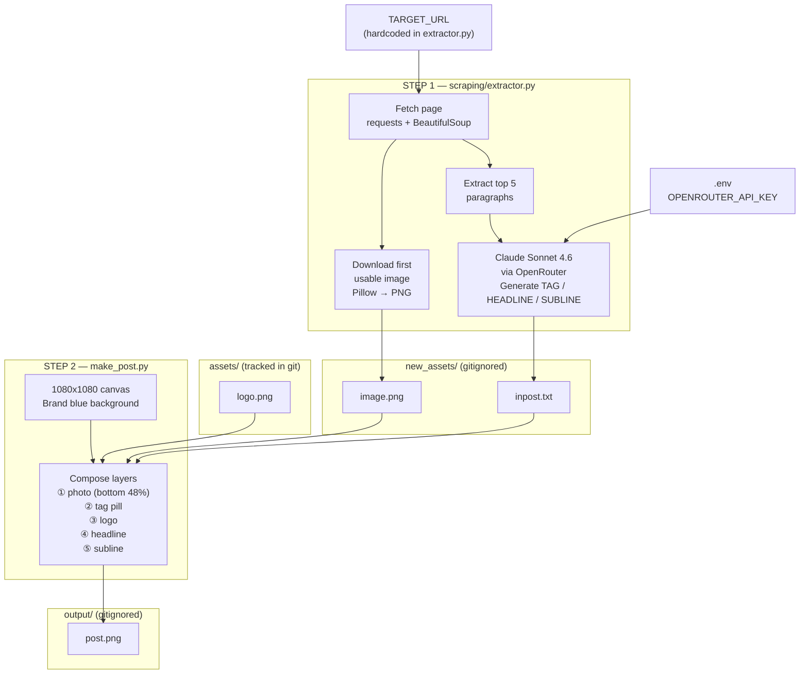

# System Flow



## Entry point

```
python main.py
```

calls `extractor.run()` → then `make_post()` in sequence.

## Data flow summary

| Stage | Input | Output |
|---|---|---|
| Scrape | `TARGET_URL` | `new_assets/image.png` |
| Summarise | page paragraphs + LLM | `new_assets/inpost.txt` |
| Compose | image + inpost + logo | `output/post.png` |
